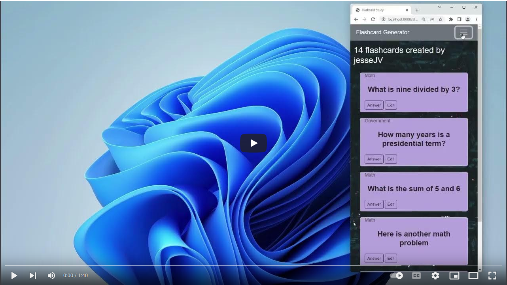

# **FlashCard_Generator**

## Project Description
This is a flashcard generator website I built to use for studying. It was built with bootstrap and the Django framework. It is coded mainly with Python, CSS and HTML. There is user authentiction, login and register features, two SQLite databases with CRUD operations, all on a responsive web design.     

## Project In Action

## Project Versions
I'd been tinkering with python for a while and was looking for a fun project to improve my skills. I got the original idea for a study aid when working on a new qualification in the navy. I earned the qualification 4 months **AFTER** I finished with this version of the project.

This started out with a simple python script to access and read a user generator text file. Each line was broken into a 'Question | Answer' format and then would read out the question, pause waiting for the user to click, and then print out the answer - all in a functional order but not very stimulating. 

After that, I added another script to allow the question bank to be updated. Again, functional but boring. What next?

That led me into the world of databases and database manipulation.

From there, the project transformed into something much larger and what it is today.  

